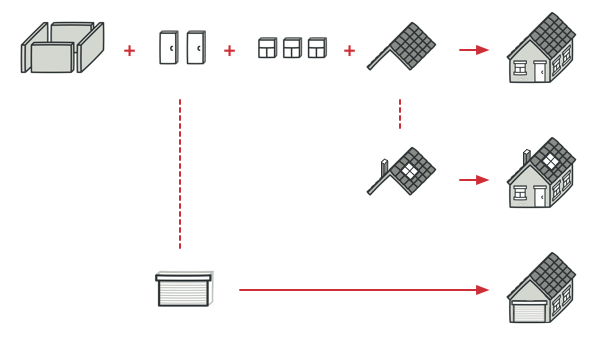

## Dio padrãos de projeto - Template

Uma aplicação simples para explorar o conceito do design pattern template, usando como exemplo construções e suas pequenas diferenças. 
> Exemplo de como um template pode ser alterado de acordo com necessidades especificas de clientes

### Referencias
 - [Template Method](https://refactoring.guru/design-patterns/template-method)
 - [Template metehod Design Pattern in Java](https://www.digitalocean.com/community/tutorials/template-method-design-pattern-in-java)
